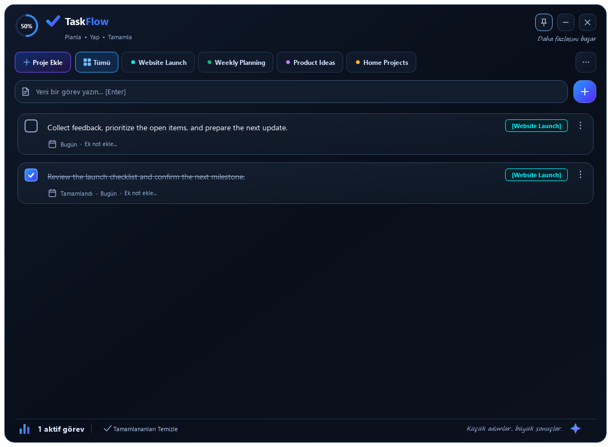

# TaskFlow

TaskFlow, Windows için yerel ve proje bazlı bir görev takip uygulamasıdır. Veriler bilgisayarınızda tutulur; uygulama herhangi bir API anahtarı veya çevrim içi hesap gerektirmez.



Ekran görüntüsü yalnızca herkese açık demo verileri kullanır; kişisel proje adları, görevler veya kullanıcıya ait env dosyaları içermez.

## İndir ve kur

En güncel Windows paketini [GitHub Releases](https://github.com/ozanydemir/TaskFlow/releases) sayfasından indirin.

1. `TaskFlowSetup.exe` dosyasını çalıştırın.
2. Kurulum wizard’ı uygulamayı `%LOCALAPPDATA%\Programs\TaskFlow` klasörüne otomatik kurar.
3. Masaüstü ve Başlat menüsü kısayollarını oluşturur, ardından TaskFlow’u başlatır.

Kurulum yönetici yetkisi gerektirmez. Mevcut bir kurulum varsa uygulama dosyasını günceller; kullanıcı verileri `%APPDATA%\TaskFlow\data.json` içinde korunur.

## Kullanım

- **Proje Ekle:** Yeni bir proje oluşturur. Sekmelerde fare tekerleği veya sürükleme ile gezinin; üç nokta menüsü tüm projeleri listeler.
- **Görev ekleme:** Metni yazıp Enter’a veya mavi-mor ekleme butonuna basın.
- **Görev kartı:** Onay kutusu görevi tamamlar; çift tıklama metni düzenler. Üç nokta menüsünden düzenleme, not ve silme işlemlerine erişin.
- **Pin:** Pencereyi diğer pencerelerin üzerinde tutar.
- **Gizle / kapat / Esc:** Uygulamayı sistem tepsisine gizler. Tamamen çıkmak için tepsi menüsündeki **Uygulamayı Kapat** seçeneğini kullanın.
- **Tamamlananları Temizle:** Seçili projedeki tamamlanan görevleri onay sonrasında siler.

Uygulama eski kompakt ölçüsü olan `440×640` ile açılır, `340×460` ölçüsüne kadar küçültülebilir ve kenar/köşelerden sürüklenerek yeniden boyutlandırılabilir.

## Kaynaktan çalıştırma

```powershell
python -m pip install PyQt5 pywin32
python main.py
```

## Windows paketleri oluşturma

```powershell
python -m pip install PyInstaller PyQt5 pywin32
python build_exe.py
python build_installer.py
```

Bu komutlar sırasıyla `dist\TaskFlow.exe` ve `dist_installer\TaskFlowSetup.exe` dosyalarını oluşturur. GitHub Actions, `v*` etiketi gönderildiğinde aynı iki dosyayı otomatik olarak Release varlığı olarak ekler.

## Doğrulama

```powershell
$env:QT_QPA_PLATFORM = 'offscreen'
python -m unittest test_app -v
python preview_design.py
```

Testler geçici verileri kullanır ve Windows başlangıç ayarını değiştirmez. Önizleme aracı gerçek görevleri kullanmadan demo ekran görüntüleri üretir.
