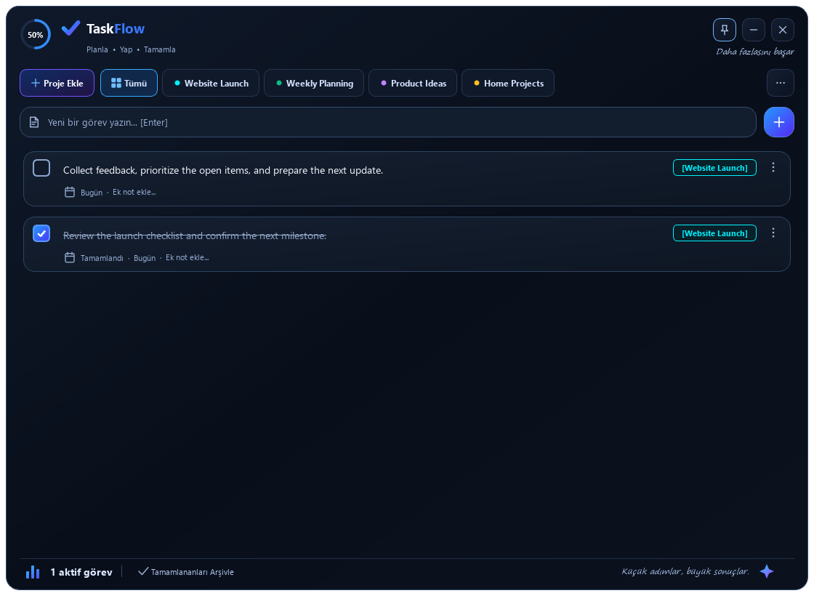

# TaskFlow

TaskFlow, Windows için yerel ve proje bazlı bir görev takip uygulamasıdır. Veriler bilgisayarınızda tutulur; uygulama herhangi bir API anahtarı veya çevrim içi hesap gerektirmez.



Ekran görüntüsü yalnızca herkese açık demo verileri kullanır; kişisel proje adları, görevler veya kullanıcıya ait env dosyaları içermez.

## İndir ve kur

En güncel Windows paketini [GitHub Releases](https://github.com/ozanydemir/TaskFlow/releases) sayfasından indirin.

1. `TaskFlowSetup.exe` dosyasını çalıştırın.
2. Kurulum wizard’ı uygulamayı `%LOCALAPPDATA%\Programs\TaskFlow` klasörüne otomatik kurar.
3. Masaüstü ve Başlat menüsü kısayollarını oluşturur, ardından TaskFlow’u başlatır.

Kurulum yönetici yetkisi gerektirmez. Mevcut bir kurulum varsa uygulama dosyasını günceller; kullanıcı verileri `%APPDATA%\TaskFlow\data.sqlite3` içinde korunur. Eski JSON kayıtları ilk açılışta, orijinal dosya ve yedeği korunarak aktarılır.

## Kullanım

- **Proje Ekle:** Yeni bir proje oluşturur. Sekmelerde fare tekerleği veya sürükleme ile gezinin; üç nokta menüsü tüm projeleri listeler.
- **Görev ekleme:** Metni yazıp Enter’a veya mavi-mor ekleme butonuna basın.
- **Görev kartı:** Onay kutusu görevi tamamlar; çift tıklama metni düzenler. Üç nokta menüsünden düzenleme, not ve silme işlemlerine erişin.
- **Pin:** Pencereyi diğer pencerelerin üzerinde tutar.
- **Gizle / kapat / Esc:** Uygulamayı sistem tepsisine gizler. Tamamen çıkmak için tepsi menüsündeki **Uygulamayı Kapat** seçeneğini kullanın.
- **Tamamlananları Arşivle:** Seçili projedeki tamamlanan görevleri ana listeden kaldırır; sonuçları, notları ve doğrulama geçmişi korunur. Üstteki üç nokta veya proje menüsünden **Arşivlenen görevler** açılır; **Geri getir** görevi tamamlanmış haliyle listeye döndürür.

Uygulama eski kompakt ölçüsü olan `440×640` ile açılır, `340×460` ölçüsüne kadar küçültülebilir ve kenar/köşelerden sürüklenerek yeniden boyutlandırılabilir.

## Agent bağlantısı

Görevleri biriktirin, proje menüsünden **Agent bağlantısını ayarla** ile yerel depo ve isteğe bağlı OZI Brain proje klasörünü seçin. Ortak `taskflow` becerisini bir kez kurduktan sonra agent sohbetine **“TaskFlow’da bekleyen Demo görevlerini yap”** yazmanız yeterlidir. Proje belirtilmezse agent bulunduğu deponun bağlantısını kullanır. Yönerge kopyalamak gerekmez; mevcut kopyalama seçeneği beceri kurulmamış ortamlarda kullanılabilir. Agent sonucu açık uygulamada otomatik görünür; onay gerektiren işler tiklenmeden sizi bekler. OZI Brain `TODO.md` dosyasındaki TaskFlow bölümü aynı kayıtlardan güncellenir. Sonuçlar ayrıca `TASKFLOW_HISTORY.md` içinde kalıcı tutulur; görev arşivlemek veya silmek bu geçmişi silmez.

Agentın yerelde tamamladığı iş **Yerelde tamamlandı**, doğrulanmış yayın **Yayınlandı** olarak görünür. Yayın gerektirmeyen işler ayrıca belirtilebilir. Yayın kaydı, yayın yapma izni veya otomatik yayın işlemi değildir. Görev menüsündeki **Yayın doğrulamasını kaydet** yalnızca gerçekleşen yayının kanıtını kaydeder. Eski görevlerin yayın durumu tahmin edilmez.

Yeni kurulum mevcut SQLite kayıtlarını ve ayarları korur. Önceden eski sürümle silinmiş görevler bu güncellemeyle geri getirilemez.

Görev eklemek agent çalıştırmaz. Ek bir API veya ücretli servis gerekmez. [Kurulum ve çalışma ayrıntıları](docs/AGENT_BRIDGE.md).

## Kaynaktan çalıştırma

```powershell
python -m pip install PyQt5 pywin32
python main.py
```

## Windows paketleri oluşturma

```powershell
python -m pip install PyInstaller PyQt5 pywin32
python build_agent.py
python build_exe.py
python build_installer.py
```

Bu komutlar `dist_agent\TaskFlowAgent.exe`, `dist\TaskFlow.exe` ve iki aracı içeren `dist_installer\TaskFlowSetup.exe` dosyalarını oluşturur. GitHub Actions, `v*` etiketi gönderildiğinde aynı üç dosyayı otomatik olarak Release varlığı olarak ekler.

## Doğrulama

```powershell
$env:QT_QPA_PLATFORM = 'offscreen'
python -m unittest test_app test_agent_bridge test_taskflow_skill test_task_history -v
python preview_design.py
```

Testler geçici verileri kullanır ve Windows başlangıç ayarını değiştirmez. Önizleme aracı gerçek görevleri kullanmadan demo ekran görüntüleri üretir.
